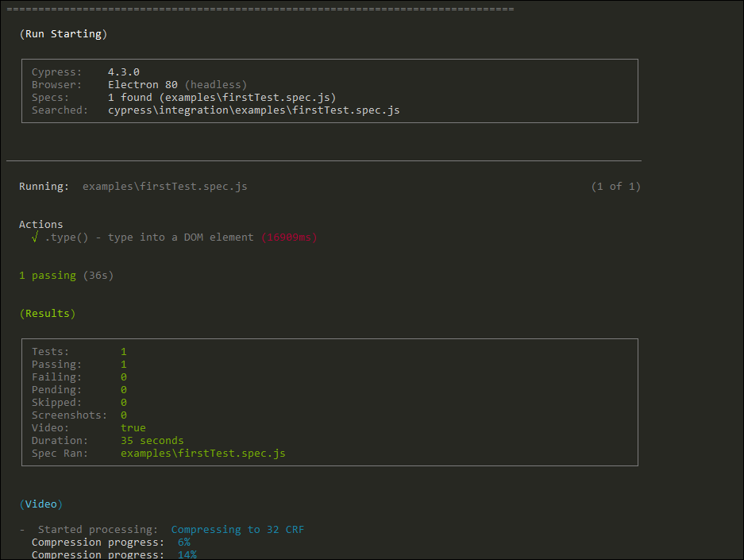
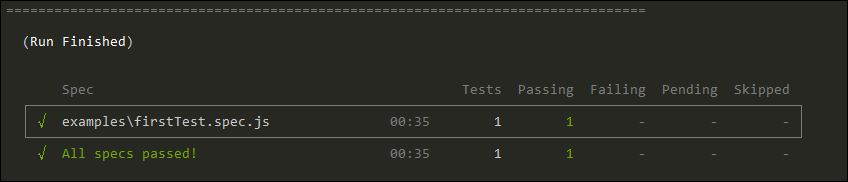

# # wiki 📚 

🦮 This is a mini Wiki for quick help.

For this POC, I created a file `firstTest.spec.js` , you can find it under `cypress-POC\cypress\integration\examples`

---

## Demo run screen shots ( cypress in action )

---
### This is how a **runnig test** will look like

---

### This is how a **Finished run** will look like

---

### `cypress` is good at keeping test Evidences, here is a how a video gets saved at:

It created and saves a vide of test run at `cypress-POC\cypress\videos\examples`, see one below

<video src="firstTest_spec_js.mp4" width="320" height="200" controls preload></video>

if you are not a video fan 🏟️  read [this page on video] for latest

---

Let's go back to Previous(main) [README.md]

---

[\\]: <> (This is a commented section and should not be visible in README file)

[README.md]: <https://github.com/eaccmk/cypress-POC>
[this page on video]: <https://docs.cypress.io/guides/guides/screenshots-and-videos.html#Videos>